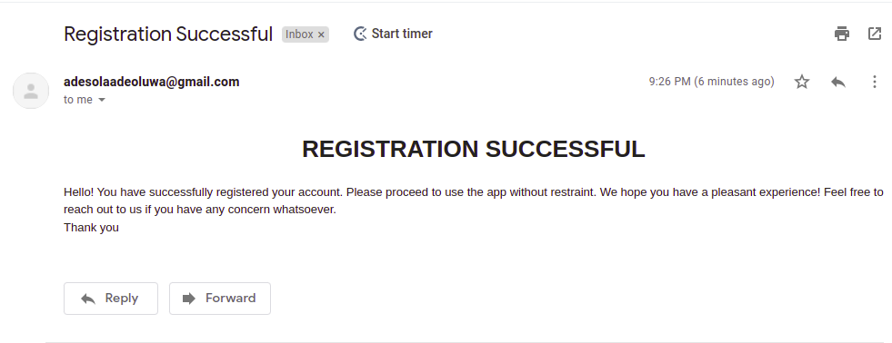

# mail-sender
This app sends emails automatically after a post request is made to the "register" route. 

## Required environmental variables
- MAIL_USERNAME
- MAIL_PASSWORD
- OAUTH_CLIENTID
- OAUTH_CLIENT_SECRET
- OAUTH_REFRESH

These can be gotten from [Google cloud console](https://console.cloud.google.com/home) and [OAuth playground](https://developers.google.com/oauthplayground/)

Refer to this [documentation](https://www.freecodecamp.org/news/use-nodemailer-to-send-emails-from-your-node-js-server/)
## Post Request Body
{
    "email": "johndoe@example.com"
}
### The image below is a screenshot of the mail sent from the NodeJs app

